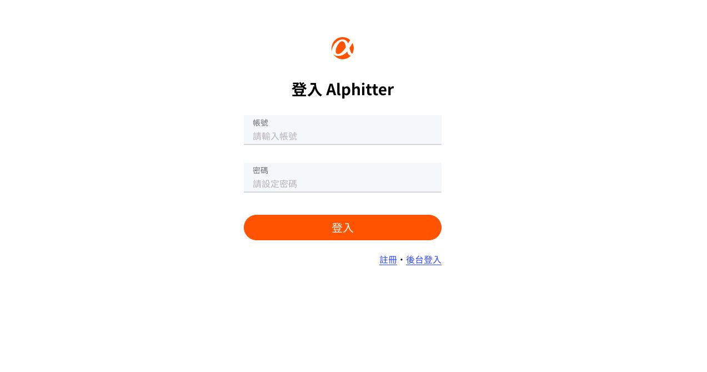
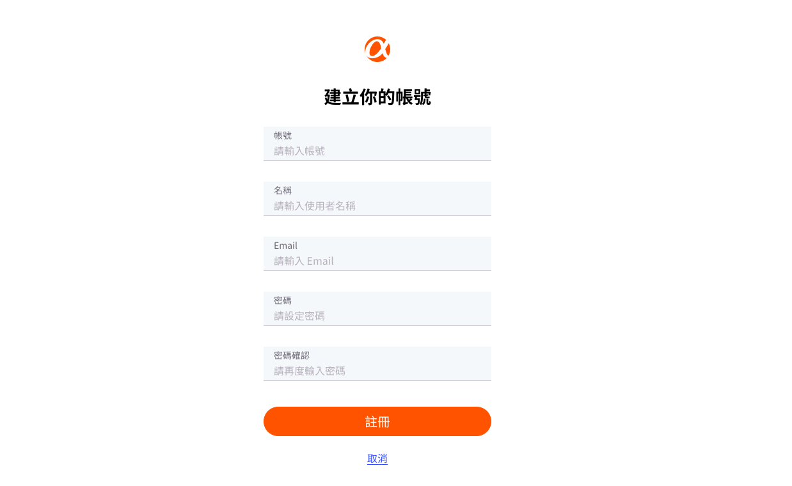
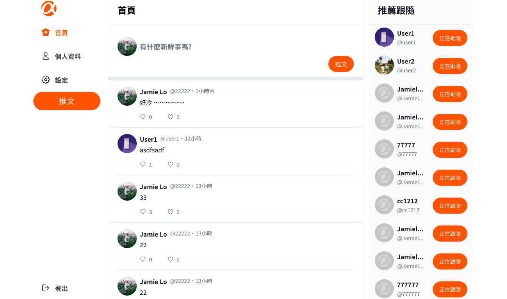
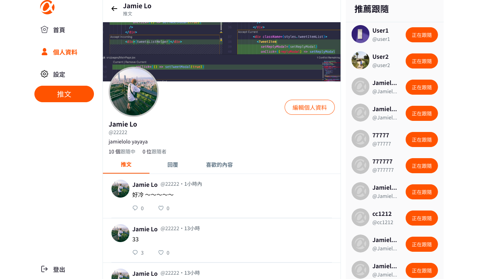
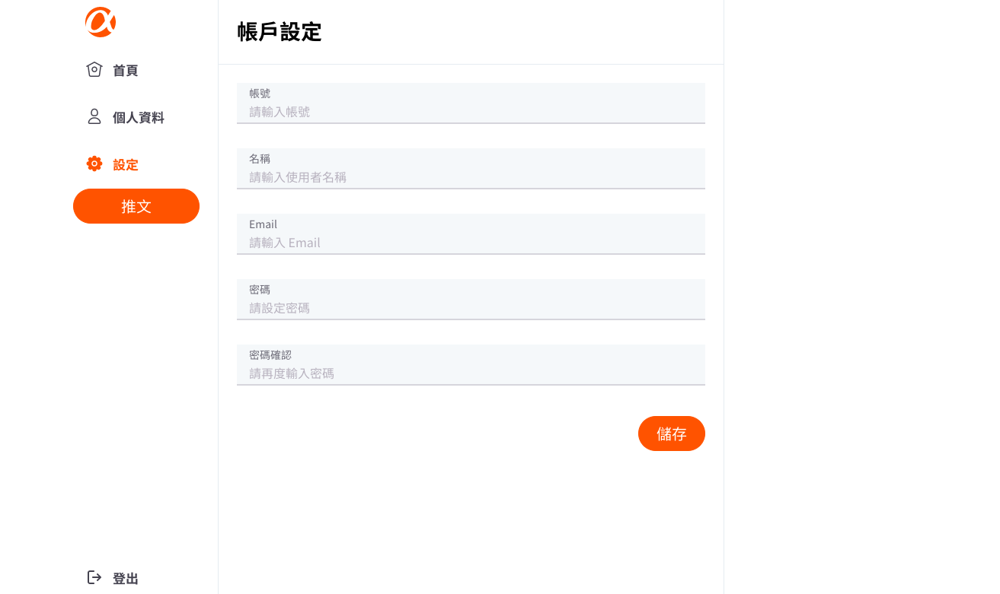
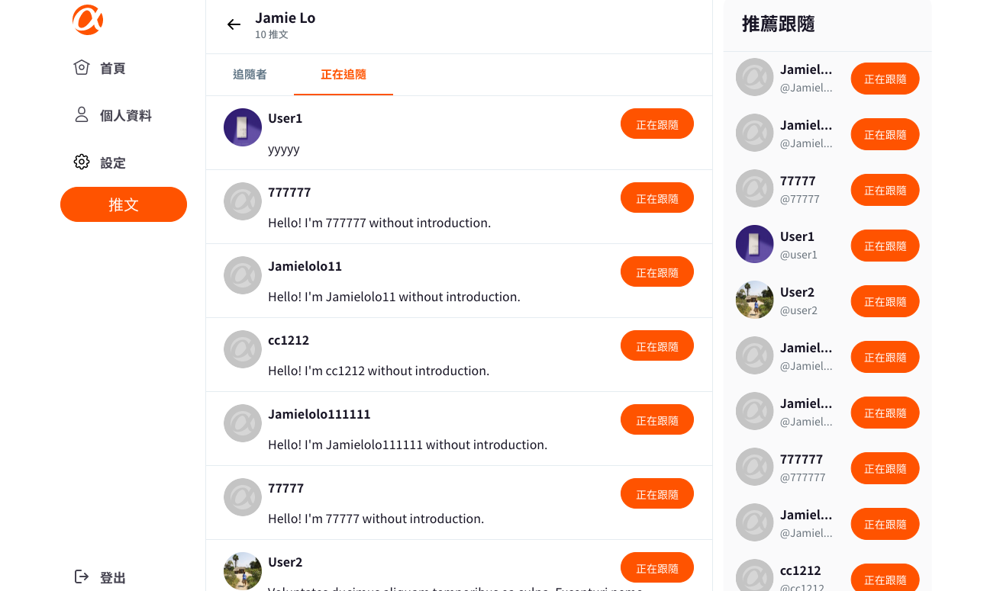
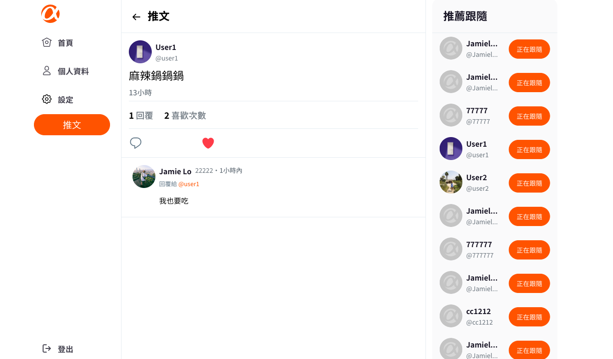
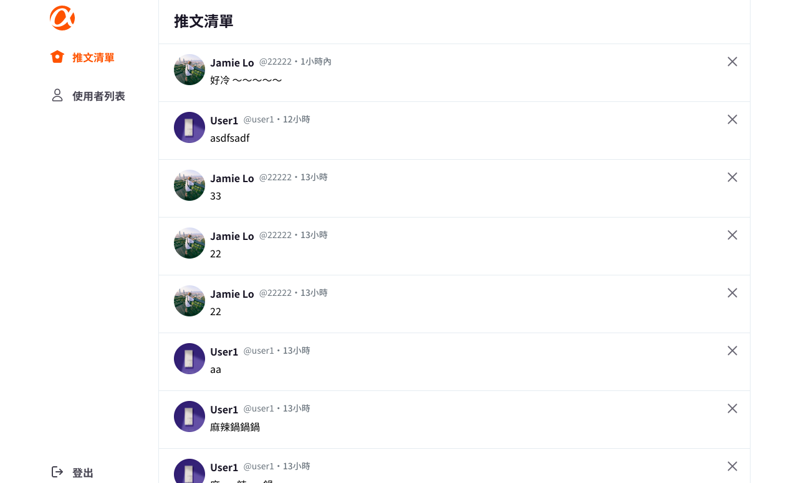
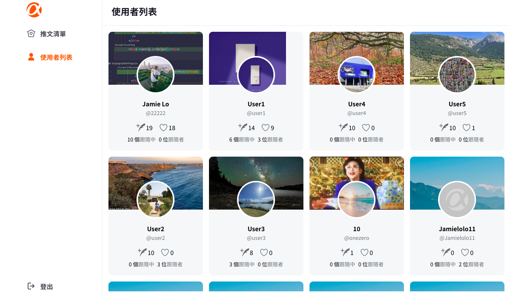

# AC Simple Twitter

此專案使用 React 打造一個簡易版的社交平台，使用者可以透過此平台與其他使用者互動。
<br/>
<br/>

## GitHub Page
https://jamielolo.github.io/ac-simple-twitter/
<br/>
<br/>

## 專案畫面

【登入頁面】

【使用者註冊頁面】

【使用者首頁】

【使用者個人資訊頁面】

【使用者帳戶設定頁面】

【使用者跟隨頁面】

【使用者單一推文頁面】

【管理者-管理推文頁面】

【管理者-查看使用者頁面】

<br/>
<br/>

## 專案功能

【使用者】

- 可以透過註冊頁面註冊。
- 可以透過使用者登入頁面登入。
- 發布推文、回覆推文。
- 更新個人資料，包含：帳號資訊設定、個人資料、個人頭像與封面照。
- 點擊其他使用者頭像或名稱，可進入其他使用者的個人資訊頁面。
- 從推薦列表清單或其他使用者個人資訊頁面，選擇跟隨或取消跟隨。
- 在跟隨頁面查看跟隨者與正在跟隨。
- 點擊推文內部文字，可進入單一推文頁面。
- 透過點擊愛心 icon 來選擇喜歡或取消喜歡一則推文。

<br/>
【管理者】

- 在管理者登入頁面登入。
- 管理者不可註冊，只可從後台設定。
- 可以在推文管理頁面刪除使用者的推文。
- 可以在後台使用者頁面查看使用者資訊，包含：發布推文數量、喜歡推文數量、跟隨者數量、正在跟隨數量。

<br/>
<br/>

## 環境建置

- react: 18.2.0
- react-scripts: 5.0.1
- react-router-dom: 6.4.5
- react-redux: 8.0.5
- This project was bootstrapped with [Create React App](https://github.com/facebook/create-react-app).

<br/>
<br/>

## 專案安裝流程

1. 打開終端機，下載此專案。

```
git clone https://github.com/JamieLoLo/ac-simple-twitter
```

2. 進入專案資料夾

```
cd ac-simple-twitter
```

3. 安裝套件

```
npm install
```

4. 啟動專案

```
npm start
```

5. 使用者登入網址位於

```
localhost:3000/users/login
```

6. 退出專案可使用以下快捷鍵

```
control + C
```

</br>
</br>

## 專案開發人員

<a href="https://github.com/JamieLoLo">Jamie Lo</a> & <a href="https://github.com/y0000ga">Yoga</a>
